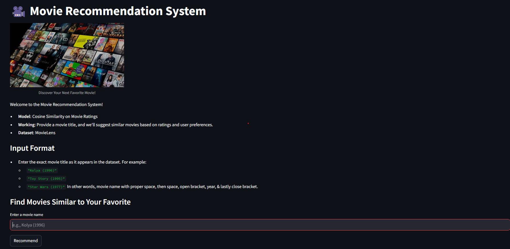
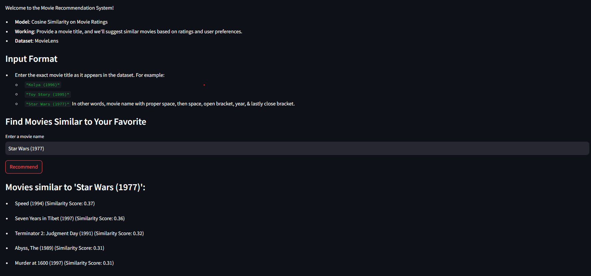
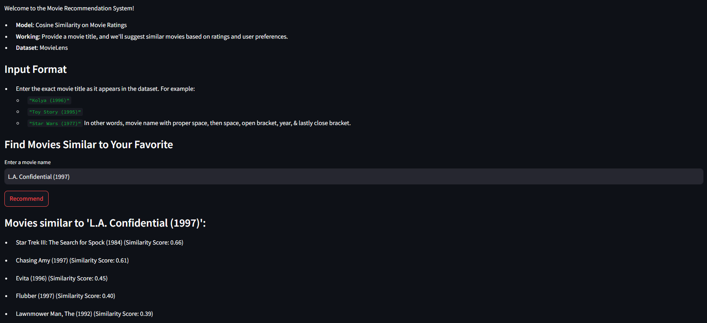
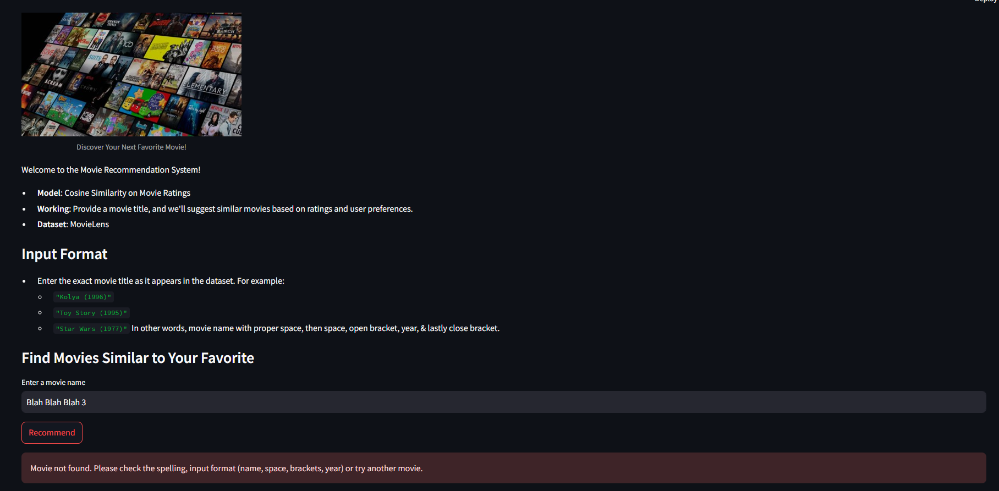

# Movie Recommendation System


## Project Overview

This project implements a **Movie Recommendation System** that suggests similar movies based on a given movie title. The system uses **Cosine Similarity** to measure the similarity between movies and generates recommendations accordingly. 

The recommendation engine is built using a **dataset of movies** with relevant features such as movie title, genre, and year of release. The system allows users to input a movie title, and it returns a list of similar movies based on cosine similarity scores.

## Features

- **Cosine Similarity** based recommendations: Finds similar movies to the input movie title.
- **Data Preprocessing**: Handles missing data, and scales and normalizes the dataset.
- **Streamlit Interface**: A simple and user-friendly web interface for interacting with the recommendation system.

## Dataset

The movie dataset used in this project is from [MovieLens dataset]([https://grouplens.org/datasets/movielens/](https://www.kaggle.com/datasets/prajitdatta/movielens-100k-dataset)). It includes various movies along with their genres, ratings, and other features which were used to build the recommendation system.

## How It Works

1. **Preprocessing**: The dataset is loaded, cleaned, and missing values are filled using the mean or other appropriate techniques.
2. **Feature Extraction**: Features such as genres and title are used to create a **cosine similarity matrix**.
3. **Cosine Similarity**: A similarity matrix is created using cosine similarity to calculate the degree of similarity between each pair of movies.
4. **Recommendation Generation**: Given an input movie, the system calculates and displays a list of most similar movies based on the similarity scores.

## Technology Stack

- **Python**: The core programming language used for data processing, model building, and web interface.
- **Streamlit**: Used for creating an interactive web app.
- **Pandas**: For data manipulation and cleaning.
- **Scikit-learn**: For calculating cosine similarity.
- **Pickle**: For saving and loading the similarity matrix model.

## Setup and Installation

### Prerequisites
- Python 3.x
- Pip (Python package installer)

### Steps to Run the Project

1. **Clone the repository**:
    ```bash
    git clone https://github.com/your-username/movie-recommendation-system.git
    cd movie-recommendation-system
    ```

2. **Install the dependencies**:
    ```bash
    pip install -r requirements.txt
    ```

3. **Run the Streamlit app**:
    ```bash
    streamlit run app.py
    ```

4. Visit the URL generated by Streamlit (usually `http://localhost:8501`) to interact with the movie recommendation system.

## Example Usage

- Input: `Star Wars (1977)`
- Output: A list of similar movies such as `Return of the Jedi (1983)`, `Empire Strikes Back (1980)`, etc.

## Output
- Home page of Movie Recommendation System Web App

- Input with movie name present in the training database (MovieLens)


- Input with movie name not present in the database  (MovieLens)


## Conclusion

This project demonstrates the implementation of a **Movie Recommendation System** using **Cosine Similarity**. With further improvements, such as incorporating user ratings, the system can be enhanced to provide more personalized movie suggestions.

## License

This project is open-source and available under the MIT License.

## Notes
- The accuracy of the model is not good as it uses rating as a feature to inference for recommending movies.
- The requirements.txt contain extra files which was not needed. So, it is better to manually install deoendencies. 
